# Table of Contents

- [Table of Contents](#table-of-contents)
- [Active sub-domain Finder](#active-sub-domain-finder)
  - [Authors](#authors)
- [Project Documentation](#project-documentation)
  - [Project Description](#project-description)
  - [1.1 Local Init and Setup](#11-local-init-and-setup)
    - [1.1.1  Local system](#111--local-system)
    - [1.1.2 Scanning sub-domains](#112-scanning-sub-domains)
    - [1.1.3 Uploading files to cloud](#113-uploading-files-to-cloud)
- [2 Pipeline Setup](#2-pipeline-setup)
  - [2.1 Repository setup](#21-repository-setup)
  - [2.2 Secret and variable setup](#22-secret-and-variable-setup)
  - [2.3 runner setup](#23-runner-setup)
    - [Clone and setup repository](#clone-and-setup-repository)
  - [1.2 Scanning](#12-scanning)
  - [1.4](#14)
- [Our Details](#our-details)
  - [🖥️🛠️ Support and 📞 Contact Information](#️️-support-and--contact-information)
  - [🚀 About Us](#-about-us)
    - [ YouTube Channels](#-youtube-channels)
    - [ Social Media Groups](#-social-media-groups)
  - [🔗 Contact Links](#-contact-links)
  - [📝 Feedback and Suggestions](#-feedback-and-suggestions)
 
# Active sub-domain Finder
<div align="justify">
The "Active Sub-domain Finder" script is designed to identify and filter active subdomains from a list of websites. Utilizing a suite of powerful tools, including <code>figlet</code> for banner display, <code>subfinder</code>, <code>amass</code>, and <code>chaos</code> for initial subdomain discovery, <code>ffuf</code> for fuzzing, and <code>httpx-toolkit</code> for probing and validating active subdomains, this script automates the entire scanning and filtering process. Additionally, it leverages <code>rclone</code> and <code>mega-cmd</code> for efficient data management and storage. The script ensures a comprehensive, automated approach to subdomain enumeration and validation, providing clear outputs and status messages in a color-coded format.
</div>


## Authors

- [Jiwan Bhattarai](https://www.linkedin.com/in/jiwanbhattarai/)
- [Subash Chaudhary](https://www.github.com/subash729)

# Project Documentation
<div align="justify">
  The "Active Sub-domain Finder" script is designed to automate several critical tasks using a suite of powerful tools. It performs comprehensive subdomain discovery with tools like <code>subfinder</code>, <code>amass</code>, and <code>chaos</code> to find all possible subdomains. It then eliminates duplicate subdomains to ensure a clean dataset. Next, it uses <code>httpx-toolkit</code> to identify and validate active and running subdomains. Finally, the script employs <code>rclone</code> and <code>mega-cmd</code> to upload the results to cloud storage, ensuring efficient and secure data management. The entire process is streamlined and user-friendly, with clear, color-coded status messages and detailed usage instructions.
</div>


## Project Description
We are doing following task by using this tools and the task are written in sequential manner
- Finding all sub-domain via many tools
- Eliminating duplicate sub-domain
- Finding active and running sub-domain
- Uploading result to cloud storage

## 1.1 Local Init and Setup
### 1.1.1  Local system
```bash
git clone https://github.com/subash729/active-subdomain-finder.git
cd active-subdomain-finder
make scanner-install
```
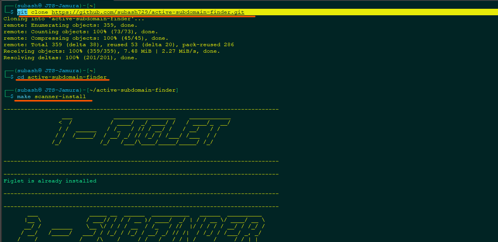

For other command use make help
```bash
make help
```
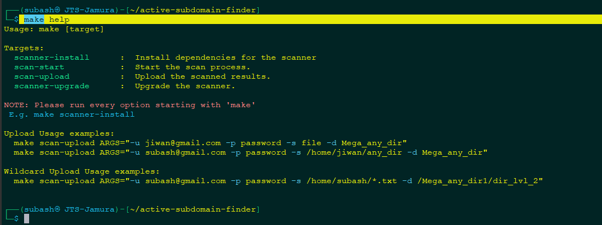

### 1.1.2 Scanning sub-domains
Let's scan by setting-up few basic things
```
echo "facebook.com" >> domain-list.txt
echo "example.com" >> domain-list.txt

# veryfying content of domain-list
cat domain-list.txt
export PDCP_API_KEY=xxxxx
make scan-start 
```
Note: <br>
chaos tool require API-key
Manual : [chaos documentation](href="https://github.com/projectdiscovery/chaos-client") <br>
API-Key : [cloud.projectdiscovery.io](https://cloud.projectdiscovery.io/?ref=api_key) <br>

Setting up: CHAOS-API-KEY <br>
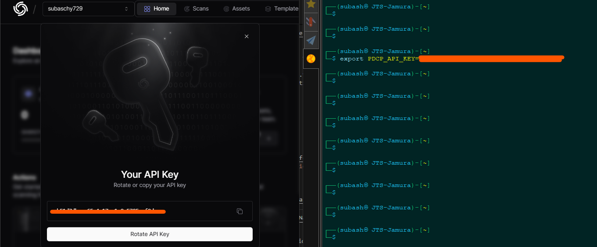
Starting scan
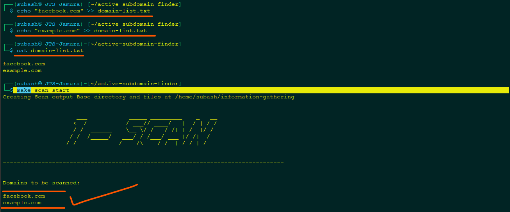

Scan Results : <br>
Total sub-domain found <br>
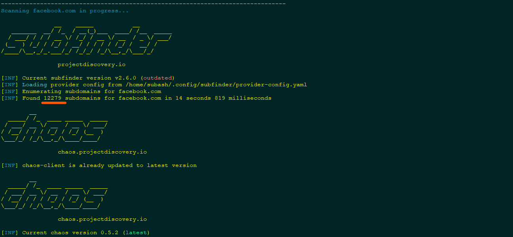
Finding Active sub-domain <br>
silent scan <br>
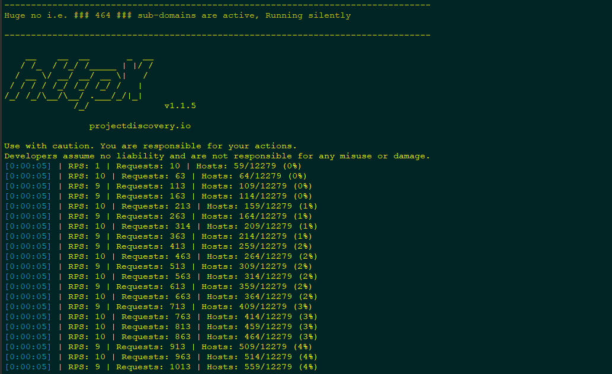
Displyaing Detailed scan: <br>
I had scanned other site i.e [usaa.com](https://www.usaa.com/).
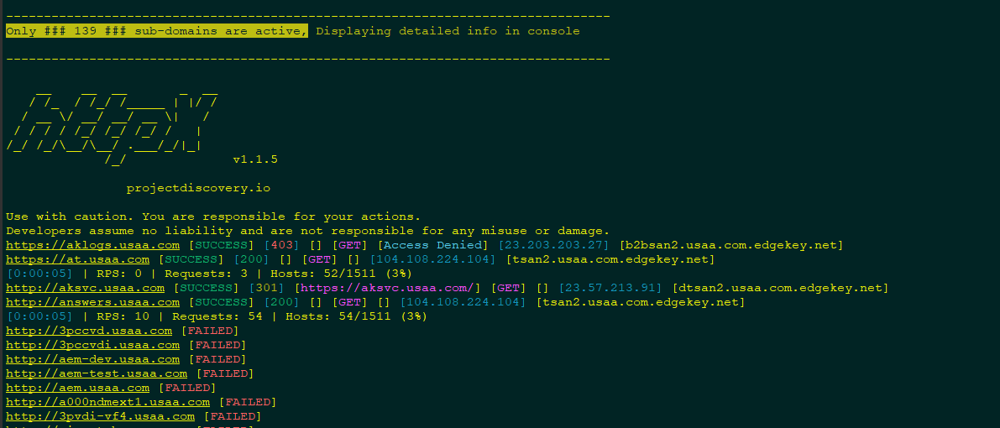

<B>Your scanned result will be stored at ```~/information-gathering/``` </B>
```
ls -al ~/information-gathering/
```
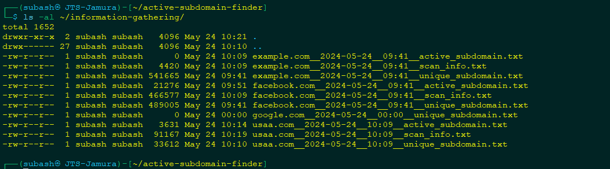

### 1.1.3 Uploading files to cloud
Uploading files to cloud to resolve issue of availabilty and sharing
 ```
#upload folder
 make scan-upload ARGS="-u pingjiwan@gmail.com -p yourmeagpassword  -s /home/subash/information-gathering/ -d /Website-scan"

# for specific file using random character
 make scan-upload ARGS="-u subashtest@gmail.com -p yourmeagpassword -s \"/home/subash/information-gathering/*.txt\" -d /Website-scan"
```
<B>Uploading files</B><br>
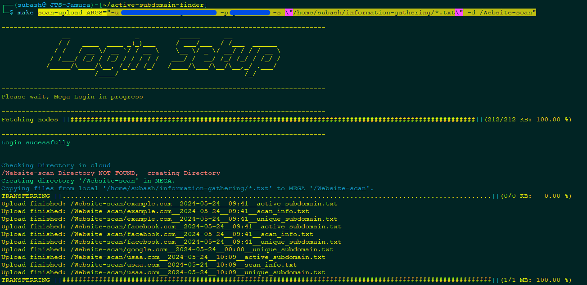
<B>Verysfying files for public</B><br>
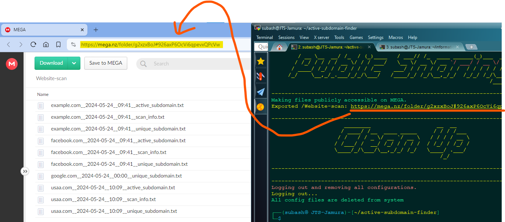

# 2 Pipeline Setup
## 2.1 Repository setup 

## 2.2 Secret and variable setup

## 2.3 runner setup 

### Clone and setup repository
Downloading my repository
```bash
git clone https://github.com/subash729/active-subdomain-finder.git
cd active-subdomain-finder
rm -rf .git
```

## 1.2 Scanning

## 1.4 


# Our Details
<div align="justify">
<B>"IT Education Nepal"</B>  and <B>"Neplese IT study community"</B> work together to provide freely available and complete IT education to everybody, including basic to advanced courses like programming, networking, system and server administration, Cloud infrastructure, IT security and graphic design. This effort is motivated by a desire to provide great education for free, with a focus on empowering students, teachers, and IT professionals equally. We aim to transform education by creating a culture of continuous learning and knowledge sharing for the benefit of Nepali society through a youth-driven, non-profit platform. <br>
<br>

<B><U>CCIE #60261 Jiwan Bhattarai</U></B> sir leads this study community, along with our dedicated team, to improve IT education literacy in Nepali. Our mission is to provide learners with practical skills and technical knowledge while also developing a collaborative supportive learning environment. Join our team to gain for more contribution.
</div>

## 🖥️🛠️ Support and 📞 Contact Information

For support or inquiries, feel free to reach out to us through the following channels:

* **<U>Jiwan Bhattarai</U>**
  - **📧 Email**: [pingjiwan@gmail.com](mailto:pingjiwan@gmail.com)
  - **📱 Phone**: +977 9866358671
  - **Viber/Whatsapp/Telegram**: +977 9866358671

* **<U>Subash Chaudhary</u>**
  - **📧 Email**: [subaschy729@gmail.com](mailto:subaschy729@gmail.com)
  - **📱 Phone**: +977 9823827047
  - **Viber/Whatsapp/Telegram**: +977 9823827047

## 🚀 About Us
<div align="justify">
We are a team of security professionals and DevOps Engineers dedicated to ensuring robust network security and efficient cloud infrastructure. Our security expertise includes certifications such as CCNA and CCNP (2012), as well as achieving the prestigious CCIE #60261 (2018). Specializing in technologies like CISCO ASA, FTD, ISE, PaloAlto, and Fortinet, we provide multivendor network security solutions. Additionally, our team holds certifications as Certified Ethical Hackers (CEH) and in Redhat Linux, enabling us to effectively safeguard digital assets.<br>
<br>

In addition to our security focus, we excel in DevOps practices, specializing in Network and Systems, as well as Cloud technologies. Our proficiency extends to Kubernetes, containerization, Continuous Integration and Continuous Deployment (CI/CD), and Infrastructure as Code (IAC) using industry-standard tools like Terraform and CloudFormation. With our comprehensive skill set, we ensure both security and efficiency in our clients' IT environments.
</div>

###   <span style="font-size: 59px;">YouTube Channels</span>
 

<p align="center" width="100%">
  <a href="https://www.youtube.com/@NepaliITStudyCommunity" style="text-align: center;">
    
  </a>
  <a href="https://www.youtube.com/@iteducationnepal-6725" style="text-align: center;">
    
  </a>
</div>


<div align="center">

<a href="https://www.youtube.com/channel/UCeMWyKMRaWt06_cxyajaUtg?sub_confirmation=1">
  
  
</a>

<a href="https://www.youtube.com/channel/UCJinKAyRTpHJOPE0YgCMhog?sub_confirmation=1">
  
  
</a>
</div>

###   <span style="font-size: 59px;">Social Media Groups</span>
click on icon to join the the group of respective platform
<p align="center" width="100%">
  <a href="https://t.me/jiwanbhattarai" style="text-align: center;">
    
  </a>
   <a href="https://t.me/jiwanbhattarai" style="text-align: center;">
    
  </a>
</div>

<div align="left">
  <a href="https://t.me/jiwanbhattarai" style="text-align: center;">
   
  </a>

  <a href="https://t.me/jiwanbhattarai" style="text-align: center;">
    
  </a>
</div>

## 🔗 Contact Links
<!-- picture section -->

<p>
  <a href="https://t.me/pingccie" style="text-align: center;">
    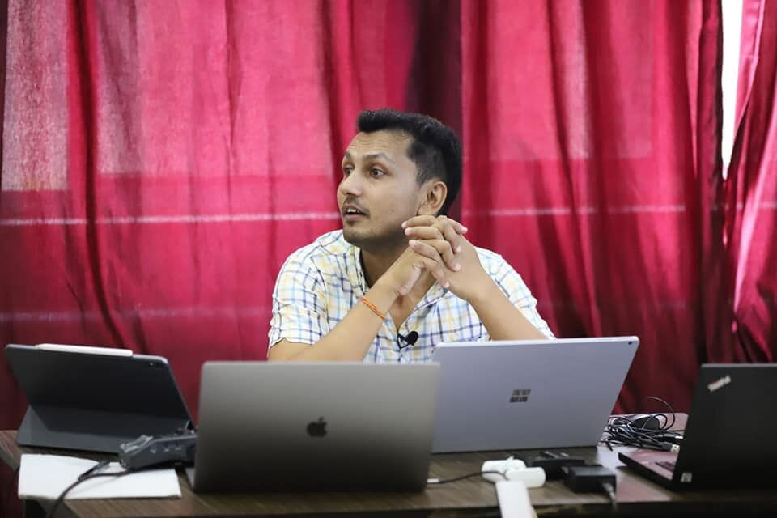
  </a>
<p>

<!-- Comment for link section -->


<p align="left" style="text-align: left;">
  <a href="http://jiwanbhattarai.com/" target="_blank">
    
  </a><br>
  <a href="https://www.linkedin.com/in/jiwanbhattarai/" target="_blank">
    
  </a><br>
  <a href="https://www.instagram.com/jiwanbhattaraiofficial/" target="_blank">
    
  </a><br>
  <a href="https://www.instagram.com/yogijiwan/" target="_blank">
    
  </a><br>
  <a href="https://twitter.com/CCIEJIWAN" target="_blank">
    
  </a><br>
</p>


<p>
    <a href="https://t.me/subash729" style="text-align: center;">
    
  </a>

<p align="left">
  <a href="https://github.com/subash729/" target="_blank">
    
  </a><br>
  <a href="https://www.linkedin.com/in/subash-chaudhary-it-engineer/" target="_blank">
    
  </a><br>
  <a href="https://www.instagram.com/rambati.subash.chaudhary.729/" target="_blank">
    
  </a><br>
  <a href="https://twitter.com/Subash729" target="_blank">
    
  </a><br>
</p>


## 📝 Feedback and Suggestions 

We welcome your feedback, suggestions, and ideas for improvement! Your input helps us enhance our services and better cater to your needs. If you have any comments, questions, or recommendations, please don't hesitate to reach out to us through the following channels:

**<u>Jiwan Bhattarai</u>**
- **Email:** [pingjiwan@gmail.com](mailto:pingjiwan@gmail.com)
- **Phone:** +977 9866358671

**<u>Subash Chaudhary</u>**
- **Email:** [subaschy729@gmail.com](mailto:subaschy729@gmail.com)
- **Phone:** +977 9823827047

Alternatively, you can submit feedback directly through GitHub:

- **GitHub Issues:** [Submit Feedback](https://github.com/subash729/Documentation-Reference/issues/new)

We appreciate your time and value your input, as it helps us continuously improve and better serve your needs.

